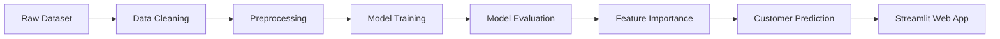

# 📊 Customer Churn Prediction using Machine Learning


<!-- Add after deployment -->
<!--
[](https://customer-churn-prediction-harsh.streamlit.app)
-->

<p align="center">

</p>

---

# 📌 Project Overview

Customer churn is one of the biggest business challenges faced by telecom companies. Retaining an existing customer is significantly more cost-effective than acquiring a new one.

This project develops an **End-to-End Machine Learning Pipeline** that predicts whether a telecom customer is likely to churn based on demographic information, subscribed services, contract details, and billing history.

The project includes:

- Data Cleaning
- Data Preprocessing
- Exploratory Data Analysis (EDA)
- Feature Engineering
- Model Training
- Model Evaluation
- Feature Importance Analysis
- Interactive Streamlit Web Application
- Business Recommendations

---

# ✨ Key Features

✅ End-to-End Machine Learning Project

✅ Interactive Streamlit Web Application

✅ Customer Churn Probability Prediction

✅ Feature Importance Analysis

✅ Business Recommendation System

✅ Model Comparison

✅ Clean Project Structure

---

# 🔄 Project Workflow



---

# 📂 Project Structure

```text
Customer-Churn-Prediction/

│

├── app.py

├── README.md

├── requirements.txt

├── .gitignore

│

├── data/

│ ├── WA_Fn-UseC_-Telco-Customer-Churn.csv

│ ├── customer_churn_preprocessed.csv

│ ├── customer_predictions.csv

│ ├── model_comparison.csv

│ └── model_evaluation.csv

│

├── models/

│ ├── random_forest_model.pkl

│ ├── logistic_regression_model.pkl

│ ├── decision_tree_model.pkl

│ └── label_encoders.pkl

│

├── notebooks/

│ ├── 1_Data_Loading.ipynb

│ ├── 2_Preprocessing.ipynb

│ ├── 3_Model_Training.ipynb

│ ├── 4_Model_Evaluation.ipynb

│ ├── 5_Customer_Churn_Prediction.ipynb

│ └── 6_Feature_Importance.ipynb

│

├── results/

│ └── feature_importance.csv

│

└── screenshots/

```

---

# 🛠 Technologies Used

- Python
- Pandas
- NumPy
- Scikit-learn
- Joblib
- Streamlit
- Matplotlib

---

# 🤖 Machine Learning Models

The following models were trained and evaluated:

- Logistic Regression
- Decision Tree Classifier
- Random Forest Classifier

## 🏆 Best Performing Model

**Random Forest Classifier**

---

# 📊 Model Performance

| Model | Accuracy |
|--------|----------|
| Logistic Regression | **79.0%** |
| Decision Tree | **73.0%** |
| Random Forest | **79.2% ✅** |

---

# 📈 Top Important Features

| Rank | Feature |
|------|----------|
| 1 | TotalCharges |
| 2 | MonthlyCharges |
| 3 | tenure |
| 4 | Contract |
| 5 | PaymentMethod |

---

# 📈 Feature Importance

<p align="center">


</p>

---

# 📊 Confusion Matrix

<p align="center">


</p>

---

# 🖥 Streamlit Web Application

The application allows users to:

- Enter customer details
- Predict customer churn
- View probability of churn
- View customer retention recommendations
- Analyze prediction confidence

---

# 📸 Application Preview

## 🏠 Home Page

<p align="center">

</p>

---

## 📊 Prediction Result

<p align="center">

</p>

---

## 💡 Business Recommendation

<p align="center">

</p>

---

# 📚 Dataset Information

Dataset: **Telco Customer Churn Dataset**

- Total Records: **7043**
- Features: **19**
- Target Variable: **Churn**

---

# ▶ Installation

Clone the repository

```bash
git clone https://github.com/harshkhande/Customer-Churn-Prediction.git
```

Move into the project folder

```bash
cd Customer-Churn-Prediction
```

Install dependencies

```bash
pip install -r requirements.txt
```

Run the application

```bash
streamlit run app.py
```

---

# 🚀 Future Enhancements

- Hyperparameter Optimization
- SHAP Explainable AI
- XGBoost Implementation
- REST API
- Docker Deployment
- Cloud Deployment
- User Authentication
- Real-time Prediction Dashboard

---

# 👨‍💻 Author

## Harshvardhan Khande

Computer Engineering Student

Interested in:

- Machine Learning
- Artificial Intelligence
- Data Analytics
- Data Science

📧 GitHub: https://github.com/harshkhande

---

# ⭐ Support

If you found this project useful, please consider giving it a ⭐ on GitHub.

---

# 📄 License

This project is developed for educational and portfolio purposes.


